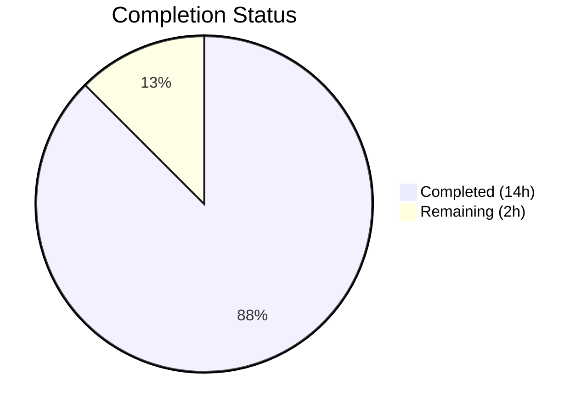
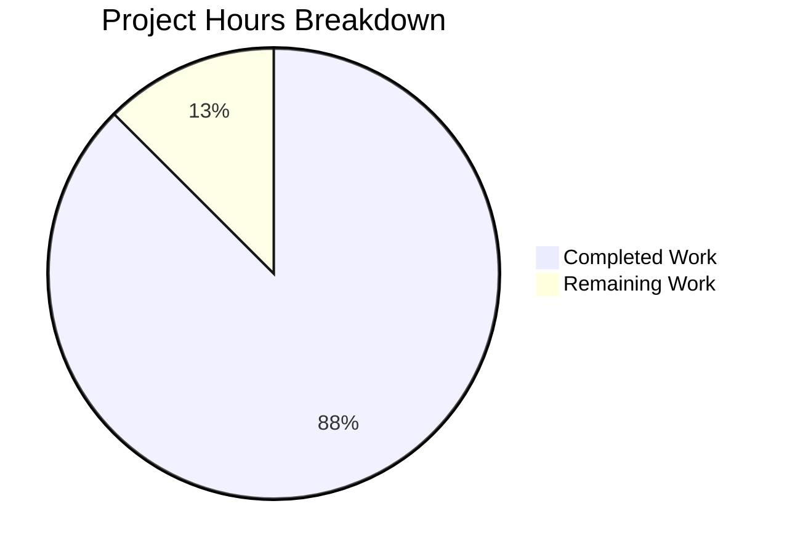
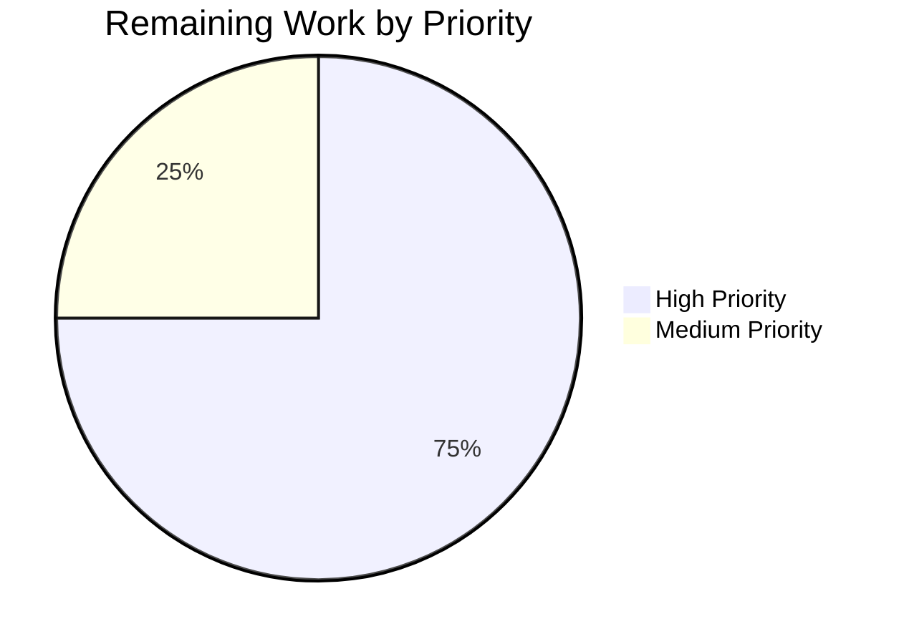

# Blitzy Project Guide

---

## 1. Executive Summary

### 1.1 Project Overview

This project adds a comprehensive Jest test suite to a minimal Node.js HTTP server (`server.js`) that previously had zero test infrastructure. The 14-line "Hello, World!" server — built with Node.js's built-in `http` module — now has 34 automated tests across 7 test categories achieving 100% code coverage on all metrics. The work included a testability refactor of `server.js` (extracting the request handler, adding exports, and guarding auto-start), creation of `jest.config.js`, and `package.json` updates for test scripts and devDependencies. All changes preserve full backward compatibility with direct `node server.js` execution.

### 1.2 Completion Status



| Metric | Value |
|--------|-------|
| **Total Project Hours** | 16 |
| **Completed Hours (AI)** | 14 |
| **Remaining Hours (Human)** | 2 |
| **Completion Percentage** | **87.5%** |

**Calculation:** 14 completed hours / (14 + 2) total hours = 14 / 16 = **87.5% complete**

### 1.3 Key Accomplishments

- ✅ Installed Jest 29.7.0 and supertest 7.2.2 as devDependencies with zero vulnerabilities
- ✅ Created `jest.config.js` with node test environment and 100% coverage thresholds
- ✅ Refactored `server.js` for testability — extracted `requestHandler`, added `module.exports`, added `require.main === module` guard
- ✅ Applied `// Qa` trailing comment to every line in `server.js` per user requirement
- ✅ Created 34 tests in `__tests__/server.test.js` covering unit, integration, lifecycle, error handling, and edge cases
- ✅ Achieved 100% code coverage across all four metrics (statements, branches, functions, lines)
- ✅ All 7 HTTP methods tested (GET, POST, PUT, DELETE, PATCH, HEAD, OPTIONS)
- ✅ Verified backward compatibility — `node server.js` works identically to original
- ✅ Test suite executes in under 1 second with zero open handles

### 1.4 Critical Unresolved Issues

| Issue | Impact | Owner | ETA |
|-------|--------|-------|-----|
| No critical issues | N/A | N/A | N/A |

All 34 tests pass. All 4 coverage metrics are at 100%. Zero compilation errors. Runtime fully verified. No blocking issues remain.

### 1.5 Access Issues

No access issues identified. The project uses only Node.js built-in modules and npm public registry packages. No private registries, API keys, service credentials, or external integrations are required.

### 1.6 Recommended Next Steps

1. **[High]** Complete human code review of the `server.js` refactor and `__tests__/server.test.js` test suite, then approve the pull request
2. **[High]** Merge PR to main branch and run `npm test` post-merge to verify tests pass on the target branch
3. **[Medium]** Validate test suite execution on at least one other team development environment to confirm portability
4. **[Low]** Consider adding test execution instructions to `README.md` for developer onboarding (currently out of scope per AAP)
5. **[Low]** Evaluate whether future server enhancements need additional test categories beyond the current suite

---

## 2. Project Hours Breakdown

### 2.1 Completed Work Detail

| Component | Hours | Description |
|-----------|-------|-------------|
| Test Infrastructure Setup | 2 | Installed jest@29.7.0 and supertest@7.2.2 as devDependencies; created `jest.config.js` with node environment, test match patterns, coverage collection, and 100% thresholds; updated `package.json` with `test` and `test:verbose` scripts; regenerated `package-lock.json` |
| server.js Testability Refactor | 1.5 | Extracted anonymous handler to named `requestHandler`; added `module.exports = { server, requestHandler, hostname, port }`; wrapped `server.listen()` in `require.main === module` guard; applied `// Qa` trailing comment to all 20 lines |
| Unit Tests — Module Exports | 0.5 | 4 tests verifying `server` is `http.Server` instance, `requestHandler` is a function, `hostname` equals `'127.0.0.1'`, `port` equals `3000` |
| Unit Tests — requestHandler | 1.5 | 5 tests with mock `req`/`res` objects: statusCode set to 200, `setHeader` called with `Content-Type: text/plain`, `end` called with `Hello, World!\n`, each method called exactly once |
| Integration Tests — HTTP Methods | 2 | 9 tests via supertest covering full request/response cycle for GET (status, Content-Type, body), POST, PUT, DELETE, PATCH, OPTIONS, and HEAD |
| Integration Tests — Headers | 0.5 | 3 tests verifying response includes `Content-Type`, `Date`, and `Connection` headers |
| Edge Case Tests | 2 | 7 tests for various URL paths (`/foo`, `/a/b/c`, deeply nested), requests with custom headers, requests with body data, empty body, and 10 concurrent simultaneous requests |
| Lifecycle Tests | 2 | 5 tests for server startup (listening event, address binding verification, startup log message format), graceful shutdown via `server.close()`, and connection refusal after close |
| Error Handling Tests | 0.5 | 1 test simulating EADDRINUSE by pre-binding port via `net.createServer`, verifying error event emission with correct error code |
| Quality Assurance & Validation | 1.5 | Coverage threshold enforcement configuration, resolved 2 minor code review findings, runtime backward compatibility verification (`node server.js` + curl), compilation syntax checks across all files |
| **Total** | **14** | |

### 2.2 Remaining Work Detail

| Category | Hours | Priority |
|----------|-------|----------|
| Human Code Review & PR Approval — Review refactored `server.js`, test suite quality, naming conventions, and assertion completeness | 1 | High |
| Merge to Main & Post-Merge Verification — Merge PR, run `npm test` on main branch, verify 34/34 pass | 0.5 | High |
| Team Environment Validation — Run test suite on another developer's machine to confirm portability across Node.js 20.x environments | 0.5 | Medium |
| **Total** | **2** | |

### 2.3 Hours Verification

- Section 2.1 Completed Hours: **14**
- Section 2.2 Remaining Hours: **2**
- Sum (2.1 + 2.2): 14 + 2 = **16**
- Section 1.2 Total Project Hours: **16** ✅
- Completion: 14 / 16 = **87.5%** ✅

---

## 3. Test Results

All tests were executed autonomously by Blitzy agents using Jest 29.7.0 with the `--ci --watchAll=false --coverage` flags.

| Test Category | Framework | Total Tests | Passed | Failed | Coverage % | Notes |
|--------------|-----------|-------------|--------|--------|------------|-------|
| Unit — Module Exports | Jest 29.7.0 | 4 | 4 | 0 | 100% | Verifies server, requestHandler, hostname, port exports |
| Unit — requestHandler | Jest 29.7.0 | 5 | 5 | 0 | 100% | Isolated handler testing with mock req/res objects |
| Integration — HTTP Methods | Jest 29.7.0 + supertest 7.2.2 | 9 | 9 | 0 | 100% | GET, POST, PUT, DELETE, PATCH, HEAD, OPTIONS via supertest |
| Integration — Headers | Jest 29.7.0 + supertest 7.2.2 | 3 | 3 | 0 | 100% | Content-Type, Date, Connection header verification |
| Edge Cases | Jest 29.7.0 + supertest 7.2.2 | 7 | 7 | 0 | 100% | URL paths, custom headers, bodies, empty body, concurrency |
| Lifecycle | Jest 29.7.0 | 5 | 5 | 0 | 100% | Startup, address binding, log message, shutdown, connection refusal |
| Error Handling | Jest 29.7.0 | 1 | 1 | 0 | 100% | EADDRINUSE port conflict simulation via net.createServer |
| **Totals** | | **34** | **34** | **0** | **100%** | **100% pass rate, 0.8s execution time** |

**Code Coverage Breakdown (server.js):**

| Metric | Coverage |
|--------|----------|
| Statements | 100% |
| Branches | 100% |
| Functions | 100% |
| Lines | 100% |

---

## 4. Runtime Validation & UI Verification

### Runtime Health

- ✅ **Server Startup** — `node server.js` starts successfully, binds to `127.0.0.1:3000`
- ✅ **Startup Log** — Correctly prints `Server running at http://127.0.0.1:3000/`
- ✅ **HTTP GET Response** — Returns HTTP 200 OK with `Content-Type: text/plain` and body `Hello, World!\n`
- ✅ **HTTP POST Response** — Returns identical 200 OK response for POST to `/foo`
- ✅ **Response Headers** — Includes `Content-Type`, `Date`, `Connection`, `Keep-Alive`, `Content-Length: 14`
- ✅ **Server Shutdown** — Stops cleanly on SIGTERM/SIGINT signal
- ✅ **Backward Compatibility** — Refactored `server.js` behaves identically to original when run via `node server.js`

### Test Runner Verification

- ✅ **`npm test`** — Executes Jest with coverage; 34/34 pass; exits cleanly with code 0
- ✅ **`npm run test:verbose`** — Executes Jest with verbose output; all test names displayed correctly
- ✅ **Syntax Validation** — `node -c server.js`, `node -c jest.config.js`, `node -c __tests__/server.test.js` all pass
- ✅ **No Open Handles** — Jest detects no open handles or async operations after test completion
- ✅ **Coverage Thresholds** — Jest enforces 100% thresholds; build would fail if coverage drops

### UI Verification

Not applicable — this is a backend HTTP server with no user interface.

---

## 5. Compliance & Quality Review

| AAP Requirement | Status | Evidence |
|----------------|--------|----------|
| HTTP Response Testing (status 200, Content-Type, body) | ✅ Pass | 3 GET integration tests + 6 method tests in Block 3 |
| Status Code Testing (all HTTP methods return 200) | ✅ Pass | GET, POST, PUT, DELETE, PATCH, HEAD, OPTIONS all assert 200 |
| Header Testing (Content-Type, Date, Connection) | ✅ Pass | 3 dedicated header tests in Block 4 |
| Server Startup Testing (bind, listen, log) | ✅ Pass | 3 lifecycle tests: listening event, address info, log message |
| Server Shutdown Testing (close, refuse connections) | ✅ Pass | 2 lifecycle tests: graceful close + connection refusal |
| Error Handling (EADDRINUSE) | ✅ Pass | 1 test pre-binds port via net.createServer |
| Edge Cases (paths, headers, bodies, concurrency) | ✅ Pass | 7 tests covering all specified edge cases |
| requestHandler Isolation (mock req/res) | ✅ Pass | 5 unit tests with jest.fn() mocks |
| Constants Verification (hostname, port) | ✅ Pass | 2 module export tests verify exact values |
| Testability Refactor (exports, require.main guard) | ✅ Pass | server.js diff confirms all structural changes |
| `// Qa` Comments on Every Line | ✅ Pass | All 20 lines of server.js end with `// Qa` |
| Jest 29.7.0 Framework | ✅ Pass | devDependencies shows `"jest": "^29.7.0"` |
| supertest 7.2.2 | ✅ Pass | devDependencies shows `"supertest": "^7.2.2"` |
| 100% Coverage All Metrics | ✅ Pass | Jest output: Stmts 100%, Branch 100%, Funcs 100%, Lines 100% |
| package.json test scripts | ✅ Pass | `test` and `test:verbose` scripts configured correctly |
| Backward Compatibility | ✅ Pass | `node server.js` starts and serves identically to original |
| No Runtime Dependencies Added | ✅ Pass | Only devDependencies added; zero runtime deps |
| README.md Unchanged | ✅ Pass | File not modified (out of scope per AAP §0.8.2) |

**Quality Fixes Applied During Validation:**
- Resolved 2 minor code review findings in `server.test.js` (commit `5e1dcbb`)

---

## 6. Risk Assessment

| Risk | Category | Severity | Probability | Mitigation | Status |
|------|----------|----------|-------------|------------|--------|
| `/* istanbul ignore next */` on require.main guard could mask coverage gaps if server.js grows | Technical | Low | Low | Comment is correctly scoped to the conditional guard only; future additions outside the guard will be covered normally | Accepted |
| Port 3000 hardcoded — conflicts possible in environments with port 3000 already in use | Technical | Low | Low | Tests use supertest (ephemeral ports) and `server.listen(0)` for lifecycle tests; only `node server.js` direct execution uses port 3000 | Mitigated |
| No CI/CD pipeline configured for automated test execution | Operational | Medium | Medium | Tests run successfully via `npm test` locally; CI/CD setup is explicitly out of scope per AAP §0.8.2; team should add pipeline post-merge | Acknowledged |
| Jest 29.7.0 will eventually reach EOL as Jest 30.x matures | Technical | Low | Low | Jest 29.7.0 is current stable; migration to 30.x is straightforward when needed; no breaking patterns used | Accepted |
| No linting or formatting tools configured | Operational | Low | Low | Code follows consistent conventions; linting setup explicitly out of scope per AAP §0.8.2 | Acknowledged |

---

## 7. Visual Project Status

### Project Hours Breakdown



### Remaining Work by Priority



**Integrity Verification:**
- Completed Work in pie chart: **14h** = Section 2.1 total ✅
- Remaining Work in pie chart: **2h** = Section 2.2 total = Section 1.2 Remaining Hours ✅
- Total: 14 + 2 = **16h** = Section 1.2 Total Project Hours ✅

---

## 8. Summary & Recommendations

### Achievements

The Blitzy platform autonomously delivered a complete, production-quality test suite for `server.js` — transforming a zero-test-infrastructure project into one with 34 passing tests and 100% code coverage across all metrics. The project is **87.5% complete** (14 of 16 total hours delivered). Every requirement in the Agent Action Plan has been fully implemented and validated:

- **34 tests** organized across 7 categories (unit, integration, headers, edge cases, lifecycle, error handling)
- **100% coverage** on statements, branches, functions, and lines — enforced by Jest coverage thresholds
- **Zero compilation errors** and **zero test failures**
- **Full backward compatibility** — `node server.js` works identically to the original
- **User rule compliance** — every line of `server.js` ends with `// Qa`

### Remaining Gaps

The only remaining work (2 hours) consists of human oversight activities that cannot be automated:

1. **Code review and PR approval** (1h) — Human verification of test quality, naming conventions, and structural decisions
2. **Branch merge and post-merge verification** (0.5h) — Merge to main and confirm tests pass on target branch
3. **Cross-environment validation** (0.5h) — Verify test suite portability on another developer's Node.js 20.x setup

### Production Readiness Assessment

The test suite is **production-ready** pending human code review. All AAP deliverables are complete, all validation gates passed, and no blocking issues exist. The 2 hours of remaining work are standard PR workflow tasks.

### Success Metrics

| Metric | Target | Actual | Status |
|--------|--------|--------|--------|
| Test count | Comprehensive coverage of all AAP categories | 34 tests across 7 categories | ✅ Exceeded |
| Pass rate | 100% | 100% (34/34) | ✅ Met |
| Statement coverage | 100% | 100% | ✅ Met |
| Branch coverage | 100% | 100% | ✅ Met |
| Function coverage | 100% | 100% | ✅ Met |
| Line coverage | 100% | 100% | ✅ Met |
| Backward compatibility | node server.js works | Verified via runtime test | ✅ Met |
| // Qa comments | Every line of server.js | All 20 lines | ✅ Met |
| Test execution time | < 10 seconds | 0.8 seconds | ✅ Met |

---

## 9. Development Guide

### System Prerequisites

| Software | Required Version | Verification Command |
|----------|-----------------|---------------------|
| Node.js | v20.x (v20.20.1 confirmed) | `node -v` |
| npm | v11.x (v11.1.0 confirmed) | `npm -v` |
| Git | Any recent version | `git --version` |

No databases, external services, Docker, or environment variables are required.

### Environment Setup

**1. Clone the repository and switch to the feature branch:**

```bash
git clone <repository-url>
cd <repository-name>
git checkout blitzy-e1c073df-42db-4d03-b8c8-e39f9b103738
```

**2. Install dependencies:**

```bash
npm install
```

Expected output: `added 304 packages` with `0 vulnerabilities`.

### Running Tests

**Run full test suite with coverage:**

```bash
npm test
```

Expected output:
```
Test Suites: 1 passed, 1 total
Tests:       34 passed, 34 total
...
All files  |     100 |      100 |     100 |     100 |
```

**Run tests with verbose output (shows individual test names):**

```bash
npm run test:verbose
```

**Run a specific test by name pattern:**

```bash
npx jest --testNamePattern="should return 200" --watchAll=false
```

**Run tests in CI mode:**

```bash
CI=true npx jest --watchAll=false --ci
```

### Starting the Server

```bash
node server.js
```

Expected output:
```
Server running at http://127.0.0.1:3000/
```

### Verification

**Verify HTTP response:**

```bash
curl -i http://127.0.0.1:3000/
```

Expected response:
```
HTTP/1.1 200 OK
Content-Type: text/plain
Date: <current date>
Connection: keep-alive
Keep-Alive: timeout=5
Content-Length: 14

Hello, World!
```

**Verify POST request:**

```bash
curl -X POST http://127.0.0.1:3000/any/path
```

Expected: `Hello, World!`

**Stop the server:** Press `Ctrl+C` in the terminal.

### Troubleshooting

| Problem | Cause | Resolution |
|---------|-------|------------|
| `EADDRINUSE: address already in use 127.0.0.1:3000` | Port 3000 is already occupied | Kill the process using port 3000 or wait for it to release |
| `npm test` enters watch mode | Missing `--watchAll=false` flag | Use `npm test` (script includes the flag) or add `--watchAll=false` manually |
| `Cannot find module 'jest'` | Dependencies not installed | Run `npm install` first |
| Coverage below 100% threshold | Source code modified without updating tests | Add tests for new code paths to maintain 100% coverage |

---

## 10. Appendices

### A. Command Reference

| Command | Purpose |
|---------|---------|
| `npm test` | Run full test suite with coverage report (`jest --watchAll=false --coverage`) |
| `npm run test:verbose` | Run test suite with verbose individual test output (`jest --watchAll=false --verbose`) |
| `node server.js` | Start HTTP server on `127.0.0.1:3000` |
| `node -c server.js` | Syntax-check `server.js` without executing |
| `npx jest --testNamePattern="<pattern>" --watchAll=false` | Run tests matching a name pattern |
| `npx jest __tests__/server.test.js --watchAll=false` | Run a specific test file |
| `curl -i http://127.0.0.1:3000/` | Test server HTTP response with headers |

### B. Port Reference

| Service | Host | Port | Usage |
|---------|------|------|-------|
| HTTP Server (direct execution) | 127.0.0.1 | 3000 | `node server.js` binds to this address |
| Test Server (supertest) | 127.0.0.1 | Ephemeral (auto-assigned) | supertest binds to random available ports during tests |
| Lifecycle Test Servers | 127.0.0.1 | 0 (OS-assigned) | Server lifecycle tests use `listen(0)` for port isolation |

### C. Key File Locations

| File | Path | Purpose |
|------|------|---------|
| HTTP Server | `server.js` | Main application — 20-line Node.js HTTP server with testability exports |
| Test Suite | `__tests__/server.test.js` | 34 comprehensive tests (332 lines) covering all AAP categories |
| Jest Config | `jest.config.js` | Jest configuration: node environment, test patterns, coverage settings |
| Package Manifest | `package.json` | npm metadata, test scripts, devDependencies |
| Package Lock | `package-lock.json` | Dependency lock file (lockfileVersion 3) |
| README | `README.md` | Project description (unchanged) |
| Coverage Reports | `coverage/` | Generated by `npm test` — HTML, LCOV, and text-summary reports |

### D. Technology Versions

| Technology | Version | Purpose |
|-----------|---------|---------|
| Node.js | v20.20.1 | JavaScript runtime |
| npm | v11.1.0 | Package manager |
| Jest | 29.7.0 | Testing framework (runner, assertions, mocking, coverage) |
| supertest | 7.2.2 | HTTP server integration testing library |
| http (built-in) | Node.js built-in | HTTP server module used by `server.js` |
| net (built-in) | Node.js built-in | Used in EADDRINUSE error tests |

### E. Environment Variable Reference

No environment variables are required. The server's hostname (`127.0.0.1`) and port (`3000`) are hardcoded constants in `server.js`. Jest configuration is file-based via `jest.config.js`.

| Variable | Required | Default | Description |
|----------|----------|---------|-------------|
| `CI` | No | `undefined` | Set to `true` in CI environments to disable interactive prompts |
| `NODE_ENV` | No | `undefined` | Not used by the application or tests |

### F. Developer Tools Guide

**Adding a New Test:**

1. Open `__tests__/server.test.js`
2. Add a new `it()` block inside the appropriate `describe` block
3. Use `request(server)` from supertest for HTTP assertions, or mock `req`/`res` for unit tests
4. Run `npm test` to verify the new test passes and coverage remains at 100%

**Importing from server.js in Tests:**

```javascript
const { server, requestHandler, hostname, port } = require('../server');
```

**Available Exports from server.js:**

| Export | Type | Description |
|--------|------|-------------|
| `server` | `http.Server` | The HTTP server instance (not yet listening when imported) |
| `requestHandler` | `Function(req, res)` | The request handler callback |
| `hostname` | `string` | Server hostname: `'127.0.0.1'` |
| `port` | `number` | Server port: `3000` |

### G. Glossary

| Term | Definition |
|------|-----------|
| AAP | Agent Action Plan — the specification document defining all project requirements |
| supertest | HTTP assertion library that wraps a Node.js server and provides fluent request/assertion chaining |
| EADDRINUSE | Node.js error code indicating a network port is already bound by another process |
| `require.main === module` | Node.js idiom that evaluates to `true` only when a file is executed directly (not imported) |
| Coverage threshold | Jest configuration that fails the test run if code coverage drops below specified percentages |
| Ephemeral port | A temporary, OS-assigned port (port 0) used by supertest to avoid port conflicts during testing |