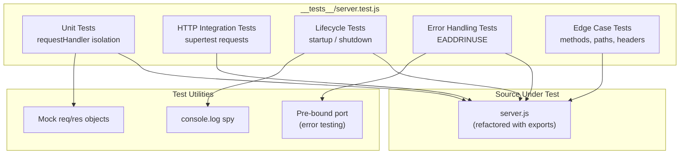

# Technical Specification

# 0. Agent Action Plan

## 0.1 Intent Clarification

### 0.1.1 Core Testing Objective

Based on the provided requirements, the Blitzy platform understands that the testing objective is to **create a comprehensive unit test suite from scratch** for `server.js`, a 14-line Node.js HTTP server that currently has zero test infrastructure, zero testing frameworks, and a placeholder `npm test` script that intentionally fails.

**Request Categorization:** Add new tests

The user's testing requirements, restated with enhanced technical clarity:

- **HTTP Response Testing** — Verify that every HTTP request to the server receives a response with status code `200`, the header `Content-Type: text/plain`, and the exact body string `Hello, World!\n`, regardless of HTTP method, URL path, request headers, or request body
- **Status Code Testing** — Confirm the server exclusively returns HTTP `200 OK` for all request permutations (GET, POST, PUT, DELETE, PATCH, HEAD, OPTIONS) and never returns error codes under normal operation
- **Header Testing** — Assert that the response includes the `Content-Type: text/plain` header and validate the full set of default HTTP headers produced by Node.js `http.createServer()` (including `Connection`, `Date`, `Transfer-Encoding`)
- **Server Startup Testing** — Validate that the server binds to `127.0.0.1:3000`, emits the startup log message `Server running at http://127.0.0.1:3000/`, and begins accepting connections
- **Server Shutdown Testing** — Verify that the server can be gracefully closed via `server.close()`, that it stops accepting new connections after close, and that active connections drain properly
- **Error Handling Testing** — Test the server's behavior when port `3000` is already in use (EADDRINUSE), and validate the error event propagation on the server object
- **Edge Cases** — Cover boundary conditions including empty request bodies, extremely long URLs, simultaneous concurrent requests, requests with malformed headers, and requests immediately after server startup

**Implicit Testing Needs Surfaced:**

- The current `server.js` uses side-effect execution (immediately starts the server when the file is loaded via `require()`), which prevents standard unit testing via module import. A testability refactor is required to export the server instance and request handler while preserving backward-compatible direct execution via `node server.js`
- The request handler callback must be independently testable in isolation (without starting a live HTTP listener) using mock `req`/`res` objects
- Server lifecycle management (startup, running, shutdown) must be tested through the exported server object
- The `hostname` and `port` constants should be verifiable from tests

### 0.1.2 Special Instructions and Constraints

**User-Specified Implementation Rule:**

> "add Qa at the end of each line as a Comment in server.js"

This directive requires appending `// Qa` as a trailing comment to every line of code in `server.js`. This modification must be applied during the server.js testability refactor. The rule applies exclusively to `server.js` and not to newly created test files.

**Testing Framework Preference:**

The user specified "Jest or Mocha" as the testing framework. Based on analysis of the project characteristics (zero existing configuration, Node.js v20 runtime, CommonJS module system, built-in `http` module), **Jest** is the recommended framework because it provides an all-in-one testing solution with built-in assertions, mocking, and coverage reporting — eliminating the need for supplementary libraries that Mocha would require (Chai for assertions, Sinon for mocking, nyc for coverage).

**Constraints Documented:**

- No existing test patterns to follow — all conventions must be established from scratch
- The project currently has zero external dependencies; adding `devDependencies` for testing is required
- The `package.json` test script must be updated from its placeholder to a working Jest command
- The `README.md` contains a "Do not touch!" directive, but the user's explicit request to add unit tests supersedes this for test-related modifications

### 0.1.3 Technical Interpretation

These testing requirements translate to the following technical test implementation strategy:

- To **test HTTP responses**, we will create `__tests__/server.test.js` using Jest with the `supertest` library to make HTTP assertions against the server's request handler without manually managing ports
- To **test status codes**, we will issue requests with all standard HTTP methods (GET, POST, PUT, DELETE, PATCH, HEAD, OPTIONS) through supertest and assert each returns status `200`
- To **test headers**, we will inspect the response object from supertest to verify `Content-Type: text/plain` and validate default Node.js HTTP headers
- To **test server startup**, we will programmatically call `server.listen()` on the exported server, verify the callback fires, and confirm the server is listening via `server.listening` property and `server.address()` method
- To **test server shutdown**, we will call `server.close()` and verify the server stops accepting connections and the close callback fires
- To **test error handling**, we will pre-bind a port to force an `EADDRINUSE` error and assert the server emits the appropriate error event
- To **test edge cases**, we will send requests with empty bodies, unusual HTTP methods, various URL paths, and verify the server responds identically to all of them
- To **enable testability**, we will refactor `server.js` to export `{ server, requestHandler, hostname, port }` and wrap the `server.listen()` call in a `require.main === module` guard

### 0.1.4 Coverage Requirements Interpretation

**Explicit Coverage Targets:** The user did not specify a numerical coverage target.

**Implicit Coverage Expectations:**

- For a 14-line server with a single code path and zero branching logic, **100% line coverage** and **100% statement coverage** are achievable and expected
- The server's deterministic behavior (identical response for all inputs) means branch coverage is trivially satisfied — there are no conditional branches in the request handler
- Function coverage should target 100% — the request handler callback and the listen callback are the only two functions

**To achieve comprehensive testing, coverage should include:**

- All executable statements in `server.js` (lines 1–14)
- The request handler callback (lines 6–9)
- The listen callback (line 13)
- The `http.createServer()` call (line 6)
- The `server.listen()` call (line 12)
- Both constants (`hostname`, `port`) verified for correct values

## 0.2 Test Discovery and Analysis

### 0.2.1 Existing Test Infrastructure Assessment

A comprehensive repository search was conducted across the entire project structure. The repository contains exactly four files at the root level with zero subdirectories:

| File | Path | Relevance to Testing |
|------|------|---------------------|
| `server.js` | `/server.js` | Primary test target — 14-line HTTP server using Node.js built-in `http` module |
| `package.json` | `/package.json` | Contains placeholder test script; must be updated with Jest configuration |
| `package-lock.json` | `/package-lock.json` | Confirms zero dependencies; will be regenerated after installing test dependencies |
| `README.md` | `/README.md` | Project documentation; no test-related content |

**Repository analysis reveals a zero-test-infrastructure starting point with no existing coverage, no testing frameworks, and no test configuration files.**

**Current Testing Framework:** None installed. The `package.json` test script is the default `npm init` placeholder:
```json
"test": "echo \"Error: no test specified\" && exit 1"
```

**Test Runner Configuration:** No test runner configuration exists. No `jest.config.js`, `jest.config.ts`, `.babelrc`, `mocha.opts`, `.mocharc.yml`, or any other testing configuration file is present in the repository.

**Coverage Tools in Use:** None. No `nyc`, `c8`, `istanbul`, or Jest built-in coverage configuration exists.

**Mock/Stub Libraries Detected:** None. No `sinon`, `nock`, `msw`, `jest-mock-extended`, or any mocking libraries are installed.

**Test Data Fixtures or Factories Present:** None. No `__fixtures__/`, `test/fixtures/`, `__mocks__/`, or test data files exist.

**Testability Assessment of `server.js`:**

The current `server.js` implementation presents a critical testability challenge. The file uses a side-effect execution model — calling `require('./server')` immediately binds `127.0.0.1:3000` and starts listening. The server object is assigned to a `const` but never exported. This means:

- No functions, objects, or classes are available for import into test files
- The request handler callback is an anonymous arrow function inline to `http.createServer()` and cannot be referenced externally
- The `hostname` and `port` constants are module-scoped and not exported

This architecture requires a **minimal testability refactor** of `server.js` before tests can be written — specifically extracting the request handler, exporting the server and constants, and guarding the `.listen()` call behind `require.main === module`.

### 0.2.2 Web Search Research Conducted

The following research was conducted to inform the testing strategy:

- **Jest Version Compatibility with Node.js 20:** Jest 29.7.0 (latest stable 29.x) supports Node.js 14.15, 16.10, 18.0 and above, making it fully compatible with the project's Node.js v20.20.1 runtime. Jest 30.x (latest 30.3.0) also supports Node.js 18+ but is very recent and less battle-tested. **Recommendation: Jest 29.7.0** for maximum stability and documentation coverage.
- **Supertest for HTTP Server Testing:** Supertest v7.2.2 is the latest stable release. It is a SuperAgent-driven library specifically designed for testing Node.js HTTP servers. It accepts an `http.Server` instance or a request handler function, automatically binds to an ephemeral port, and provides a fluent assertion API for status codes, headers, and response bodies.
- **Testing Node.js `http.createServer()` Best Practices:** The standard pattern for testing raw Node.js HTTP servers involves exporting the server/handler, using supertest to make requests, and employing Jest lifecycle hooks (`beforeAll`/`afterAll`) for server startup and teardown.
- **CommonJS Module Testability Pattern:** The `require.main === module` guard is the established Node.js pattern for creating files that can both run directly via `node file.js` and be imported for testing without side effects.

## 0.3 Testing Scope Analysis

### 0.3.1 Test Target Identification

**Primary Code to Be Tested:**

- **Module:** `server.js` at `/server.js` — requires unit tests and HTTP integration tests covering the request handler, server lifecycle, error scenarios, and edge cases

**Functions and test categories needed:**

| Function / Component | Location | Test Categories Required |
|---------------------|----------|------------------------|
| `requestHandler(req, res)` | `server.js` line 6 (extracted) | Unit: response status, headers, body; Edge: various HTTP methods, paths |
| `http.createServer(handler)` | `server.js` line 6 | Integration: server creation, handler binding |
| `server.listen(port, hostname, cb)` | `server.js` line 12 | Lifecycle: startup, callback, address binding |
| `server.close()` | implicit | Lifecycle: graceful shutdown, callback |
| `hostname` constant | `server.js` line 3 | Unit: correct value `'127.0.0.1'` |
| `port` constant | `server.js` line 4 | Unit: correct value `3000` |

**Existing Test File Mapping:**

| Source File | Existing Test File | Test Categories Present |
|-------------|-------------------|----------------------|
| `server.js` | None — no test file exists | None |
| `package.json` | None | None |

**Dependencies Requiring Mocking:**

- **Node.js `http` module** — The built-in `http` module may need to be mocked for isolated unit tests of the request handler. For integration tests via supertest, the real `http` module is used
- **`console.log`** — The startup callback logs a message via `console.log`. This should be spied on to verify the correct startup message without polluting test output
- **Network port binding** — For EADDRINUSE error testing, a pre-bound port is needed to simulate the conflict scenario

### 0.3.2 Version Compatibility Research

Based on the project's Node.js v20.20.1 runtime (no minimum version enforced in `package.json`), the recommended testing stack is:

| Tool | Package Name | Recommended Version | Compatibility Rationale |
|------|-------------|-------------------|----------------------|
| Testing framework | `jest` | 29.7.0 | Latest stable 29.x; supports Node.js 14.15, 16.10, 18.0+; most documented and widely used version |
| HTTP testing library | `supertest` | 7.2.2 | Latest stable; compatible with Node.js built-in `http.Server`; fluent assertion API for status codes, headers, body |
| Coverage tool | Built-in Jest `--coverage` | (bundled with Jest 29.7.0) | Jest includes istanbul-based coverage via `--coverage` flag; no separate `nyc` or `c8` install needed |

**Version Conflicts to Resolve:** None. This is a greenfield testing setup with zero existing dependencies. All packages are installed fresh with no compatibility constraints from existing tooling.

**Why Jest 29.7.0 over Jest 30.x:**
- Jest 30.3.0 is the latest major release but was released very recently (June 2025) with significant breaking changes including removed matcher aliases and changed CLI flag names
- Jest 29.7.0 is the proven, mature final release of the 29.x line with extensive community documentation
- For a greenfield project with no migration burden, 29.7.0 provides maximum stability

**Why Not Mocha:**
- The user specified "Jest or Mocha" — both are valid choices. Jest is selected because it provides assertions (`expect`), mocking (`jest.fn()`, `jest.spyOn()`), and coverage reporting as built-in features. Mocha would require separate installation of Chai (assertions), Sinon (mocking), and nyc (coverage), adding complexity to a simple project

## 0.4 Test Implementation Design

### 0.4.1 Test Strategy Selection

**Test Types to Implement:**

- **Unit tests** — Focus on the isolated request handler function (`requestHandler`), verifying it correctly sets status code `200`, the `Content-Type: text/plain` header, and ends the response with `Hello, World!\n`. Uses mock `req`/`res` objects to test the handler without an HTTP listener
- **Integration tests** — Cover the full HTTP request-response cycle through supertest, issuing real HTTP requests against the server and asserting complete responses including status, headers, and body
- **Edge case tests** — Address boundary conditions: all HTTP methods (GET, POST, PUT, DELETE, PATCH, HEAD, OPTIONS), various URL paths (`/`, `/foo`, `/a/b/c`), requests with custom headers, requests with bodies, empty requests, and concurrent requests
- **Error handling tests** — Verify the server's behavior when port 3000 is already in use (EADDRINUSE error event), and test graceful server close behavior
- **Lifecycle tests** — Test server startup (binding, listening state, address info, startup log), and shutdown (close callback, connection termination)

### 0.4.2 Test Case Blueprint

```
Component: requestHandler (server.js lines 6-9)
Test Categories:
- Happy path: GET request returns 200 with "Hello, World!\n"
- Happy path: Response Content-Type is "text/plain"
- Happy path: Response body is exactly "Hello, World!\n"
- Edge cases: POST, PUT, DELETE, PATCH, HEAD, OPTIONS all return 200
- Edge cases: Requests to /, /foo, /bar/baz all return identical response
- Edge cases: Request with custom headers still returns same response
- Edge cases: Request with body still returns same response
```

```
Component: server lifecycle (server.js lines 1, 6, 12-14)
Test Categories:
- Happy path: Server starts and listens on configured host/port
- Happy path: server.listening returns true after startup
- Happy path: server.address() returns correct host and port
- Happy path: Startup callback logs correct message
- Happy path: Server closes gracefully via server.close()
- Error cases: EADDRINUSE when port is occupied
- Error cases: Server emits error event on port conflict
```

```
Component: Constants and exports (server.js lines 3-4)
Test Categories:
- Happy path: hostname equals '127.0.0.1'
- Happy path: port equals 3000
- Happy path: Module exports server, requestHandler, hostname, port
```

### 0.4.3 Existing Test Extension Strategy

There are no existing tests to extend, refactor, or fix. This is a pure greenfield test creation effort. All test files, configurations, and conventions will be established from scratch.

### 0.4.4 Test Data and Fixtures Design

**Required Test Data Structures:**

No complex test data structures, fixtures, or factories are needed. The server under test is stateless and returns an identical response for all inputs. Test data consists solely of:

- HTTP request parameters (method, URL, headers, body) — constructed inline within each test case
- Expected response values (status `200`, header `Content-Type: text/plain`, body `Hello, World!\n`) — defined as constants in the test file

**Mock Object Specifications:**

- **Mock `req` object** — A minimal mock of Node.js `http.IncomingMessage` for unit-testing the request handler in isolation. Only needs to exist as a parameter; no properties are read by the handler
- **Mock `res` object** — A mock of Node.js `http.ServerResponse` with `jest.fn()` stubs for `statusCode` (setter), `setHeader()`, and `end()` methods
- **`console.log` spy** — `jest.spyOn(console, 'log')` to capture and assert the startup log message without printing to test output

**Test Database/State Management:**

Not applicable. The server is completely stateless with no data persistence. Each test is inherently isolated because the server produces identical output regardless of previous requests or state.



## 0.5 Test File Transformation Mapping

### 0.5.1 File-by-File Test Plan

| Target Test File | Transformation | Source File/Test | Purpose/Changes |
|-----------------|----------------|------------------|-----------------|
| `__tests__/server.test.js` | CREATE | `server.js` | Comprehensive unit test suite covering HTTP responses, status codes, headers, server startup/shutdown, error handling, and edge cases across all HTTP methods and URL paths |
| `server.js` | UPDATE | `server.js` | Testability refactor: extract request handler to named function, export `{ server, requestHandler, hostname, port }`, wrap `server.listen()` in `require.main === module` guard, append `// Qa` comment to every line per user rule |
| `jest.config.js` | CREATE | N/A | Jest configuration file defining test environment (`node`), test match patterns, coverage thresholds, and coverage collection settings |
| `package.json` | UPDATE | `package.json` | Add `devDependencies` (jest, supertest), update `test` script to `jest --watchAll=false --coverage`, add `test:verbose` script |
| `package-lock.json` | UPDATE | `package-lock.json` | Automatically regenerated by `npm install` after adding devDependencies |

### 0.5.2 New Test Files Detail

**`__tests__/server.test.js`** — Comprehensive unit and integration test suite

- **Test categories:**
  - Happy path: Standard GET request returns 200, correct Content-Type, correct body
  - Edge cases: All HTTP methods (GET, POST, PUT, DELETE, PATCH, HEAD, OPTIONS), various URL paths, custom headers, request bodies
  - Error cases: EADDRINUSE port conflict, server error event emission
  - Lifecycle: Server startup (listen callback, address binding, log message), server shutdown (close callback, connection refusal)
  - Unit: Request handler isolation with mock req/res, constant values verification
- **Mock dependencies:** Mock `req`/`res` objects for handler isolation, `console.log` spy for startup log verification, pre-bound `net.Server` for port conflict testing
- **Assertions focus:** Status code equality (`200`), header matching (`Content-Type: text/plain`), body string equality (`Hello, World!\n`), server state properties (`.listening`, `.address()`), callback invocation, error event emission

**`jest.config.js`** — Jest configuration

- Test environment: `node`
- Test match: `**/__tests__/**/*.test.js`
- Coverage collection from: `server.js`
- Coverage thresholds: lines 100%, statements 100%, functions 100%, branches 100%

### 0.5.3 Test Files to Modify Detail

No existing test files to modify. All test files are new creations.

**Source file modification:**

**`server.js`** — Testability refactor with the following changes:

- Extract the anonymous request handler arrow function to a named `requestHandler` constant
- Add `module.exports = { server, requestHandler, hostname, port }` at end of file
- Wrap `server.listen(...)` call inside `if (require.main === module) { ... }` block
- Append `// Qa` comment to every line per the user's implementation rule
- Preserve all existing behavior when executed directly via `node server.js`

**`package.json`** — Configuration updates:

- Add `devDependencies` object with `jest` and `supertest`
- Replace test script placeholder with `jest --watchAll=false --coverage`
- Add `test:verbose` script as `jest --watchAll=false --verbose`

### 0.5.4 Test Configuration Updates

| Config File | Update Description |
|------------|-------------------|
| `jest.config.js` | Create new file: set `testEnvironment: 'node'`, `collectCoverageFrom: ['server.js']`, `coverageThreshold` for 100% on all metrics, `testMatch: ['**/__tests__/**/*.test.js']` |
| `package.json` | Update `scripts.test` from placeholder to `jest --watchAll=false --coverage`; add `scripts["test:verbose"]` as `jest --watchAll=false --verbose` |
| `package.json` | Add `devDependencies` block with `jest: "^29.7.0"` and `supertest: "^7.2.2"` |

### 0.5.5 Cross-File Test Dependencies

**Shared Fixtures:** Not applicable — no shared fixtures needed for a single-file test target.

**Mock Objects:** All mocks are defined inline within `__tests__/server.test.js` using Jest's built-in `jest.fn()` and `jest.spyOn()`. No external mock files are needed.

**Test Utilities:** No shared test utility files are required. The `supertest` library provides all HTTP testing utilities, and Jest provides all assertion and mocking capabilities.

**Import Updates Required:**

- `__tests__/server.test.js` must import from the refactored `server.js`:
  ```javascript
  const { server, requestHandler, hostname, port } = require('../server');
  ```
- `__tests__/server.test.js` must import `supertest`:
  ```javascript
  const request = require('supertest');
  ```

## 0.6 Dependency Inventory

### 0.6.1 Testing Dependencies

| Registry | Package Name | Version | Purpose |
|----------|-------------|---------|---------|
| npm | `jest` | ^29.7.0 | Testing framework — provides test runner, assertion library (`expect`), mocking (`jest.fn`, `jest.spyOn`), and built-in coverage reporting via istanbul |
| npm | `supertest` | ^7.2.2 | HTTP server testing — SuperAgent-driven library that accepts an `http.Server` or handler function, binds to ephemeral ports, and provides fluent assertion chaining for status codes, headers, and response bodies |

**Runtime Dependencies:** No new runtime dependencies are introduced. Jest and supertest are strictly `devDependencies` and are not shipped with the application.

**Built-in Node.js Modules Used in Tests:**

| Module | Purpose in Tests |
|--------|-----------------|
| `http` | Already used by `server.js`; imported in tests for type verification |
| `net` | Used in EADDRINUSE error tests to pre-bind a port and simulate port conflicts |

### 0.6.2 Import Updates

**Test files requiring import statements:**

- `__tests__/server.test.js` — Imports from refactored `server.js` and `supertest`

**Import structure for the test file:**

```javascript
const { server, requestHandler, hostname, port } = require('../server');
const request = require('supertest');
```

**Import transformation rules for source file:**

The current `server.js` has no exports. After the testability refactor:

- **New addition:** `module.exports = { server, requestHandler, hostname, port };`
- **Apply to:** `server.js` only
- **No other files require import updates** — the project contains only one source file

## 0.7 Coverage and Quality Targets

### 0.7.1 Coverage Metrics

**Current Coverage:** 0% — no test suite exists and no coverage data has ever been collected.

**Target Coverage:** 100% across all metrics, based on the following rationale:

- The `server.js` file is 14 lines of code with zero conditional branches, making 100% coverage trivially achievable
- The server's deterministic behavior (identical response for all inputs) means every line is exercised by any single request test
- The user requested "comprehensive" tests, which implies maximum coverage for a file of this size

**Coverage Gaps to Address:**

| Component | Current | Target | Focus Areas |
|-----------|---------|--------|-------------|
| `server.js` — request handler (lines 6–9) | 0% | 100% | Status code assignment, header setting, response body |
| `server.js` — server creation (line 6) | 0% | 100% | `http.createServer()` invocation |
| `server.js` — constants (lines 3–4) | 0% | 100% | `hostname` and `port` value verification |
| `server.js` — listen call (lines 12–13) | 0% | 100% | Startup binding and log callback |
| `server.js` — module exports (new) | 0% | 100% | Export statement for testability |

**Per-File Coverage Targets:**

| File | Lines | Statements | Functions | Branches |
|------|-------|-----------|-----------|----------|
| `server.js` | 100% | 100% | 100% | 100% |

### 0.7.2 Test Quality Criteria

**Assertion Density Expectations:**

- Each test case should contain at least one meaningful assertion
- HTTP response tests should assert all three response components: status code, Content-Type header, and response body
- Lifecycle tests should assert server state before and after the operation

**Test Isolation Requirements:**

- Each test must be independent and runnable in any order
- Server instances created during tests must be closed in `afterEach` or `afterAll` hooks to prevent port conflicts between test cases
- `console.log` spies must be restored after each test to prevent interference
- No test should depend on the outcome of any other test

**Performance Constraints:**

- The full test suite should complete in under 10 seconds
- Individual test cases should complete in under 2 seconds
- Server startup/shutdown tests should use ephemeral ports (via supertest) to avoid port conflicts and binding delays

**Maintainability Standards:**

- Test descriptions must use clear, descriptive strings following the pattern: `"should [expected behavior] when [condition]"`
- Tests should be organized in `describe` blocks by category (HTTP responses, lifecycle, error handling, edge cases)
- Magic values should be defined as constants at the top of the test file
- Test setup and teardown should use Jest lifecycle hooks (`beforeAll`, `afterAll`, `beforeEach`, `afterEach`)

**Repository Test Patterns and Conventions:**

Since no existing test patterns exist in the repository, the following conventions are established:

- Test directory: `__tests__/` (Jest default convention)
- Test file naming: `[source-file].test.js`
- Test runner: Jest with `--watchAll=false` for CI-safe execution
- Coverage: Collected via Jest `--coverage` flag with 100% threshold enforcement

## 0.8 Scope Boundaries

### 0.8.1 Exhaustively In Scope

**New Test Files:**

- `__tests__/server.test.js` — Complete unit and integration test suite for `server.js`

**Source File Updates (for testability):**

- `server.js` — Testability refactor (export handler, server, constants; add `require.main === module` guard; append `// Qa` comments per user rule)

**Test Configuration:**

- `jest.config.js` — New Jest configuration file
- `package.json` — Updated `scripts.test`, new `devDependencies` block

**Dependency Manifest Updates:**

- `package.json` — Add `devDependencies` for `jest` and `supertest`
- `package-lock.json` — Regenerated after dependency installation

### 0.8.2 Explicitly Out of Scope

- **Feature additions to `server.js`** — No new routes, middleware, error handlers, or request processing logic will be added beyond the minimal testability refactor
- **Refactoring beyond testability** — The server's core logic (request handler behavior, hostname, port) will not be changed; only the module structure is updated to enable testing
- **README.md modifications** — The readme will not be updated as part of this testing effort
- **Production dependency additions** — No runtime `dependencies` will be added; only `devDependencies` for testing
- **End-to-end testing** — No browser-based, Playwright, Cypress, or Puppeteer tests
- **Performance/load testing** — No benchmarking, stress testing, or performance profiling
- **CI/CD pipeline creation** — No GitHub Actions, GitLab CI, Jenkins, or other CI/CD configuration files
- **Docker/containerization** — No Dockerfile or docker-compose configuration for test environments
- **TypeScript conversion** — The project remains JavaScript; no TypeScript types, `tsconfig.json`, or type definitions will be added
- **Linting/formatting** — No ESLint, Prettier, or other static analysis tools will be added
- **Security scanning** — No `npm audit` automation or vulnerability scanning infrastructure
- **Documentation updates** — No changes to `README.md` or creation of testing documentation files

## 0.9 Execution Parameters

### 0.9.1 Testing-Specific Instructions

**Test Execution Commands:**

| Command | Purpose |
|---------|---------|
| `npm test` | Run full test suite with coverage (maps to `jest --watchAll=false --coverage`) |
| `npm run test:verbose` | Run full test suite with verbose output (maps to `jest --watchAll=false --verbose`) |
| `npx jest --watchAll=false --ci` | CI-safe execution without watch mode |
| `npx jest __tests__/server.test.js` | Run specific test file |
| `npx jest --testNamePattern="should return 200"` | Run tests matching a pattern |

**Coverage Measurement Command:**

```
npx jest --coverage --watchAll=false
```

This generates a coverage report in the `coverage/` directory with HTML, LCOV, and text-summary formats using Jest's built-in istanbul integration.

**Single Test Execution Pattern:**

```
npx jest --testNamePattern="<test name pattern>" --watchAll=false
```

**Debug Mode Execution:**

```
node --inspect-brk node_modules/.bin/jest --runInBand --watchAll=false
```

**Environment Setup Requirements for Tests:**

- Node.js v20.x (v20.20.1 confirmed installed)
- npm v11.x (v11.1.0 confirmed installed)
- Dependencies installed via `npm install` (installs jest and supertest from `devDependencies`)
- No environment variables required
- No database or external service connections needed
- Port 3000 must not be pre-occupied when running lifecycle tests (tests use ephemeral ports via supertest where possible)

**Specific Test Patterns to Follow:**

- Use `describe` blocks to group related tests by category
- Use `beforeAll`/`afterAll` for server lifecycle management in integration tests
- Use `jest.spyOn(console, 'log')` for startup log verification
- Use supertest's `request(server)` pattern for HTTP assertions (supertest auto-binds ephemeral ports)
- Close all server instances in teardown hooks to prevent `EADDRINUSE` between test suites

**Excluded Test Categories:**

- No snapshot tests (not applicable to HTTP responses)
- No browser/DOM tests (no UI component)
- No performance benchmark tests
- No database integration tests (no database exists)

## 0.10 Special Instructions for Testing

### 0.10.1 Testing-Specific Requirements

The following special instructions apply to this testing implementation, derived from the user's explicit directives and the project's architectural constraints:

**User-Specified Implementation Rule — Qa Comments:**

> "add Qa at the end of each line as a Comment in server.js"

Every line in `server.js` must have `// Qa` appended as a trailing comment. This applies to the refactored version of `server.js` including all new lines added for testability (exports, `require.main` guard). Blank lines receive only the comment. This rule does **not** apply to test files (`__tests__/server.test.js`), configuration files (`jest.config.js`), or `package.json`.

**Minimal Source Code Modification Principle:**

The `server.js` refactor for testability must preserve the existing behavior exactly when the file is executed directly via `node server.js`. The changes are limited to:

- Extracting the anonymous handler to a named constant
- Adding `module.exports`
- Wrapping `server.listen()` in a `require.main === module` guard
- Appending `// Qa` comments per the user's rule

No functional behavior changes, new features, or additional middleware will be introduced.

**Test Isolation and Independence:**

- All tests must be runnable independently and in any order
- Server instances started during tests must be stopped in teardown hooks
- Tests must not leave orphaned listeners or open handles (Jest detects these via `--detectOpenHandles`)
- Each `describe` block manages its own server lifecycle

**Backward Compatibility:**

- Direct execution via `node server.js` must continue to work identically to the original (server starts, listens on 127.0.0.1:3000, logs startup message)
- The `require.main === module` guard ensures that importing `server.js` from a test file does not trigger an automatic `.listen()` call
- The exported `server` object remains a valid `http.Server` instance that tests can call `.listen()` on with custom ports

**Naming Conventions:**

- Test file: `__tests__/server.test.js` (follows Jest default `__tests__/` directory convention)
- Test descriptions: Use `describe('Component/Feature', () => { ... })` blocks with `it('should [behavior] when [condition]', () => { ... })` test cases
- Constants: Define expected values (`EXPECTED_STATUS`, `EXPECTED_BODY`, `EXPECTED_CONTENT_TYPE`) at the top of the test file for maintainability

